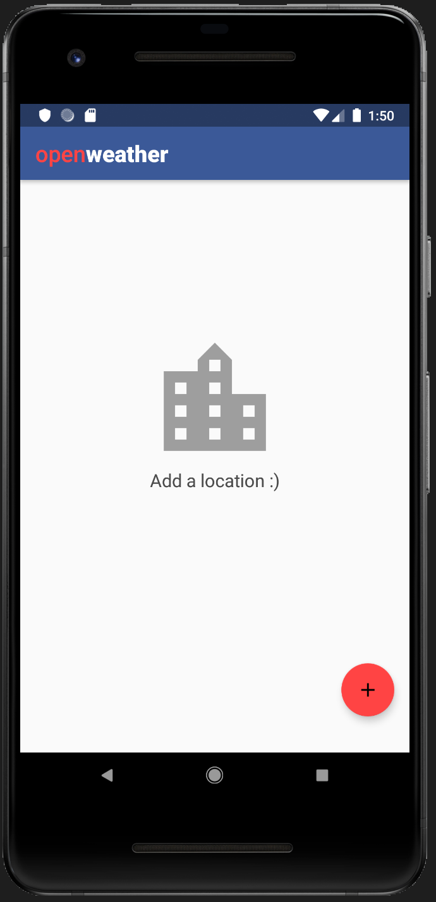
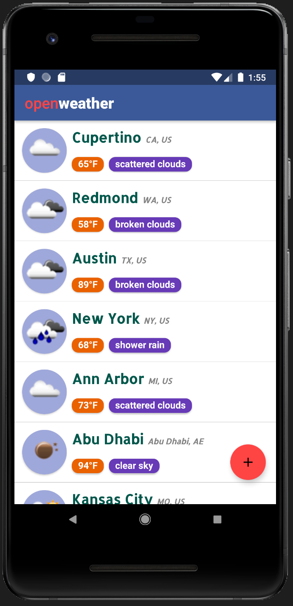
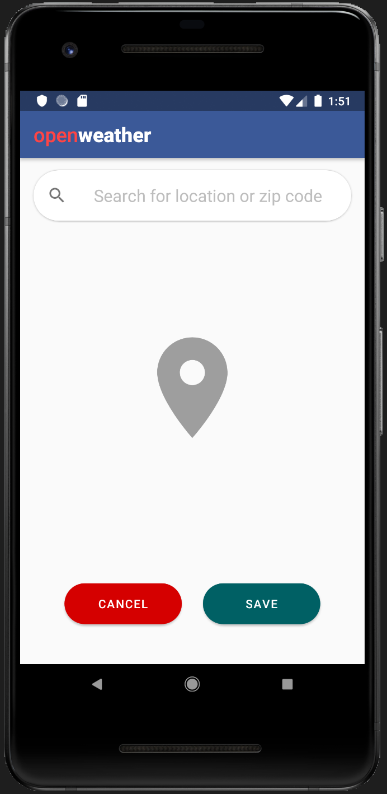
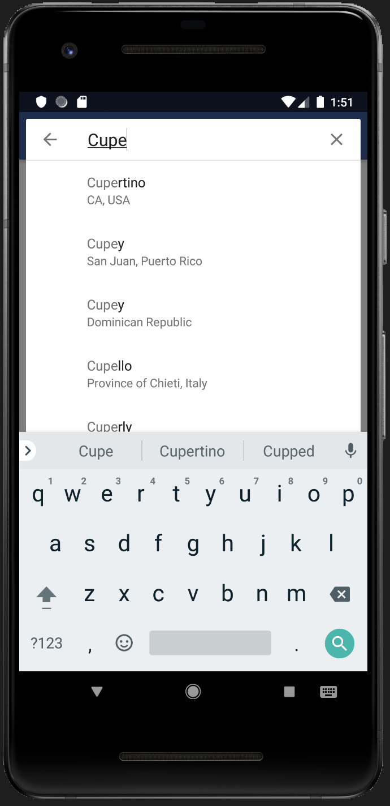
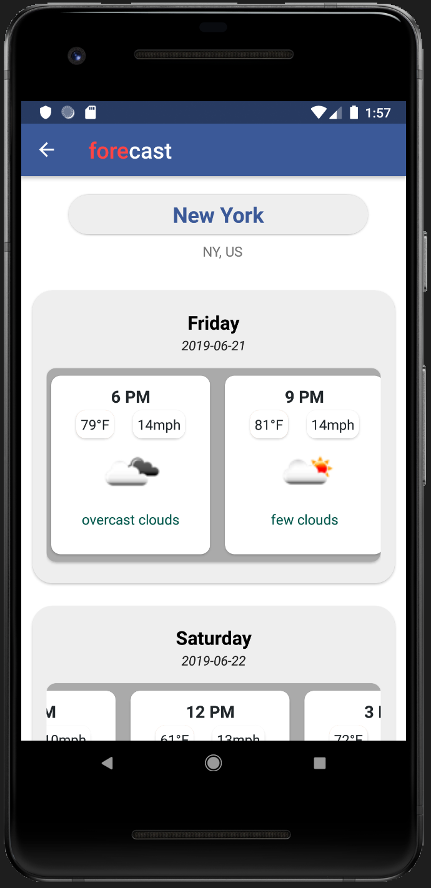
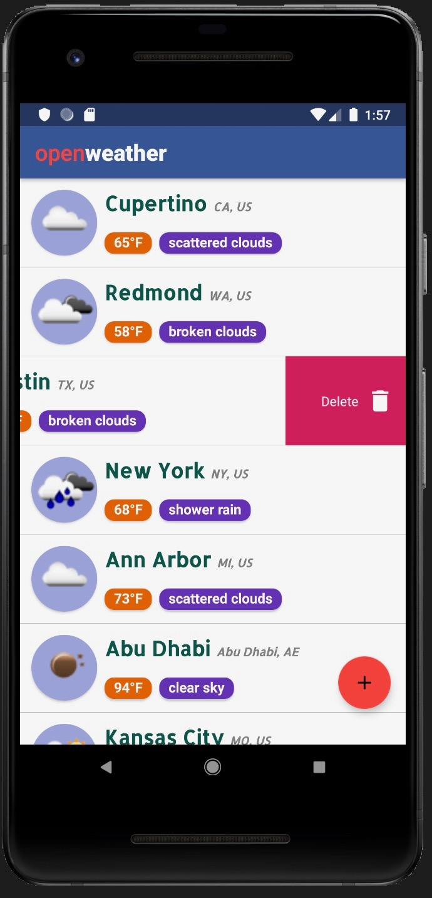

# OpenWeather

## Description
OpenWeather is an Android application designed to look for a location's weather and forecast details. The application uses [OpenWeatherMap](https://openweathermap.org/api) APIs to fetch weather conditions 

## Features
* **Add Location** : To add a location click on the floating button.
* **Edit Location** : To edit a location long press on the item.
* **Delete Location** : To delete a location swipe from right.
* **View Forecast** : To view the forecast click on the item.

## Screenshots
  | Home                                            | Locations                                            | Search          |
  |-------------------------------------------------|------------------------------------------------------|-----------------|
  |  |  | |
  
  | Search Results                                            | Forecast Details                                    | Delete |
  |-----------------------------------------------------------|-----------------------------------------------------|--------|
  |  |  | |

## Limitations
The app saves the locations using Room Persistence library. While refreshing or launching the app all the location IDS are passed to Open Weather API as a group. But the API often fails to return results for multiple cities. 

Thus, only the places with weather information are displayed during refresh or application launch. Usually the API has a limitation for 20 cities for a group call but the current results are different.
